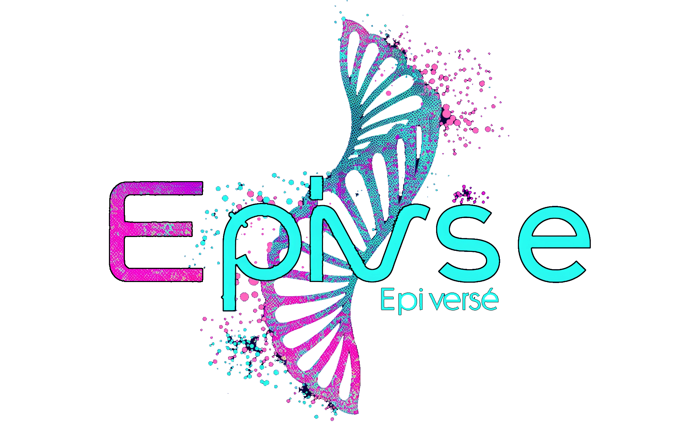

# Welcome to Epiverse’s documentation!

{ align=right width=300 }

Epiverse is the fundamental package for multi omics included bulk and single cell ATAC-seq analysis with Python.

To get started with `epiverse`, check out the [Installation](Installation_guild) and [Tutorials](Tutorial).

For more details about the epiverse framework, please check out our [publication]().

## Contact

- Lei Hu ([1157269262@qq.com](mailto:1157269262@qq.com))
- Zehua Zeng ([starlitnightly@163.com](mailto:starlitnightly@163.com), or [zehuazeng@xs.ustb.edu.cn](mailto:zehuazeng@xs.ustb.edu.cn))

